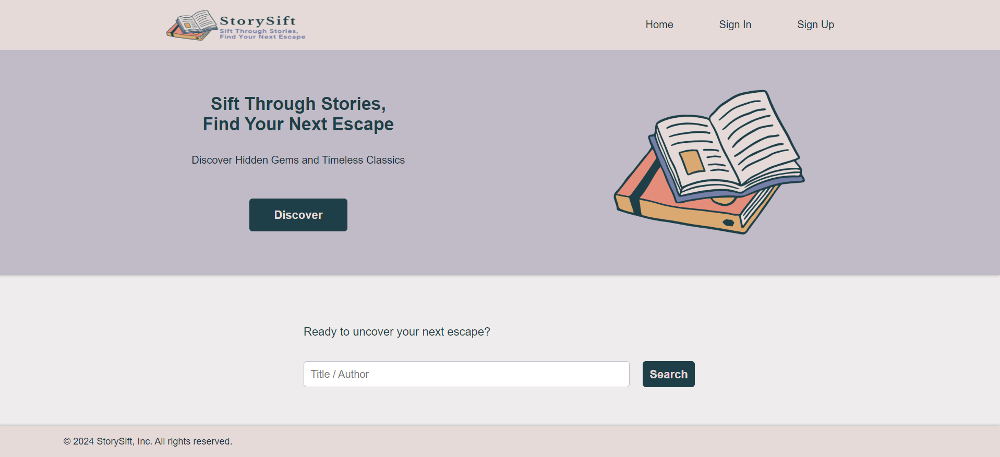
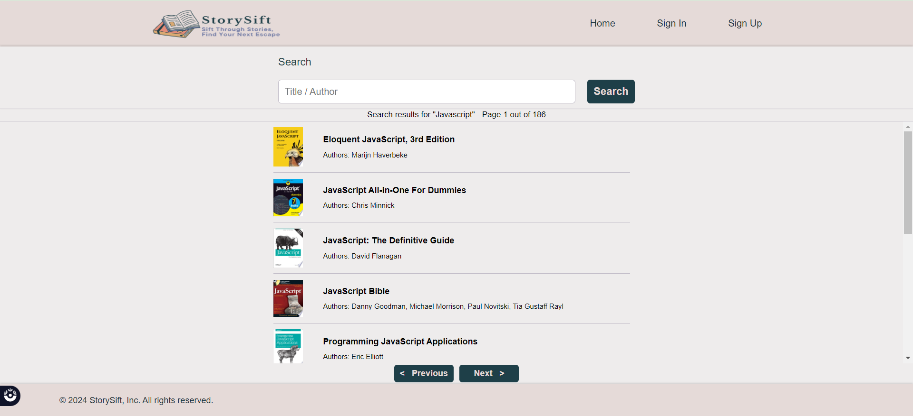
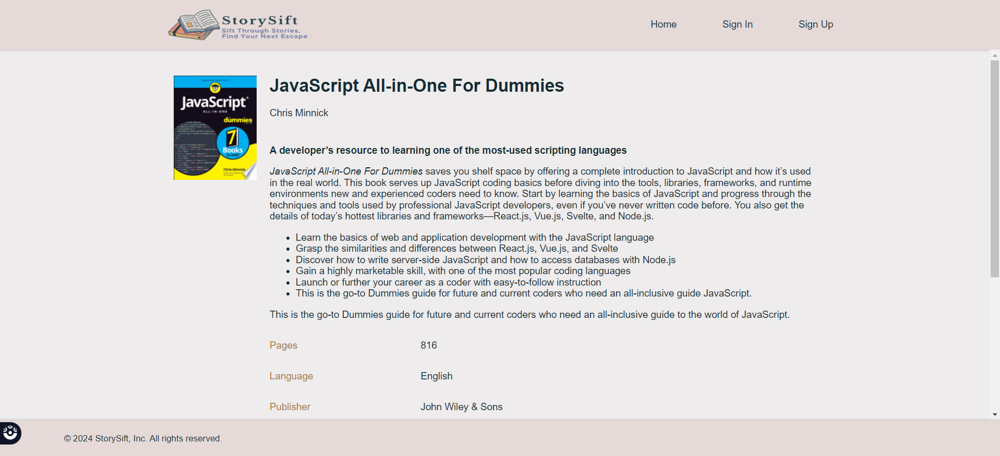
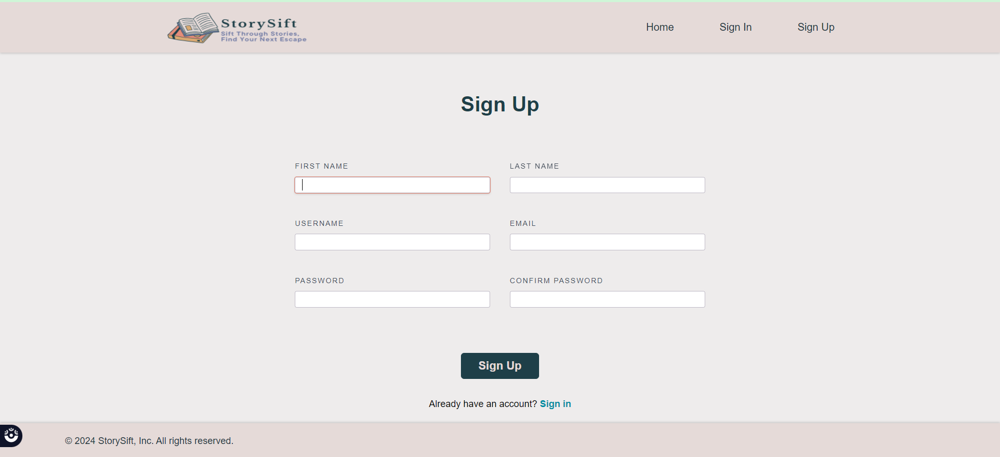
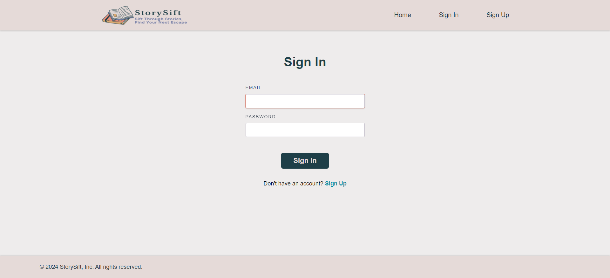
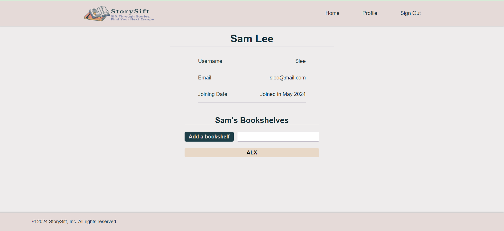
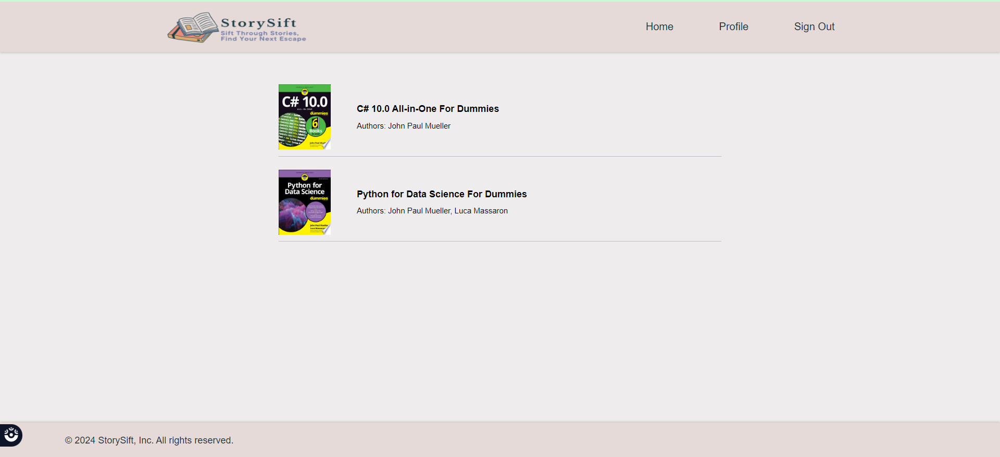

# StorySift

StorySift is a user-friendly book lookup/finder app designed to simplify the process of discovering and engaging with books. With streamlined search features, StorySift caters to book enthusiasts, students, and researchers alike.

## Table of Contents

- [Features](#features)
- [Technologies Used](#technologies-used)
- [Contributing](#contributing)
- [License](#license)

## Features

- **Search for Books**: Users can search for books by entering keywords or phrases in a search bar.





- **View Search Results**: Users can view a list of search results containing relevant book titles and authors.





- **Book Details**: Users can click on a book from the search results to view detailed information, including the book summary and cover image.





- **User Authentication**: Users can sign up for an account and sign in to access personalized features such as saving favorite books.








- **View profile details**: Users that have signed up will have access to personalized features such as saving favorite books.





- **Bookshelves**: Users can organize their saved books by category with the bookshelves feature.



## How to Install

To install and run StorySift locally on your machine, follow these steps:

1. Clone the repository to your local machine:
```bash
git clone https://github.com/Maddily/storysift.git
```
2. Navigate to the project directory:
```bash
cd storysift
```
3. Install the necessary dependencies using npm (Node Package Manager):
```bash
npm install
```
4. Create a `.env` file in the root directory of the project and add your Google Books API key:
```
GOOGLE_BOOKS_API_KEY=your_api_key_here
```
5. Start the server:
```bash
node app.js
```
6. Once the server is running, open your web browser and navigate to `http://localhost:3000` to access StorySift.

That's it! You can now use StorySift to search for books, view search results, and explore book details.

## Technologies Used

StorySift is built using the following technologies:
* Frontend:
  * HTML
  * CSS
  * JavaScript
* Backend:
  * Node.js
  * Express.js
  * MongoDB (with Mongoose for database modeling)
* Libraries:
  * Axios
  * CORS (Cross-Origin Resource Sharing) middleware for Express.js
* API:
  * Google Books API

## Data Model


## Contributing

To contribute to StorySift, follow these steps:

1. Fork the repository.
2. Create a new branch (`git checkout -b feature-name`).
3. Make your changes.
4. Commit your changes (`git commit -am 'Add new feature'`).
5. Push to the branch (`git push origin feature-name`).
6. Create a new pull request.

## Authors

Mayada Saeed - <a href="https://github.com/Maddily">Github</a> / <a href="https://www.linkedin.com/in/mayadase/">LinkedIn</a><br>
Sibongile Nhlema - <a href="https://github.com/Sibongile-Nhlema">Github</a> / <a href="https://www.linkedin.com/in/sibongile-nhlema/">LinkedIn</a><br>

## Acknowledgments

* The logo is by ©Rizelle Anne Galvez via <a href="https://www.canva.com/" target="_blank">Canva.com</a>
* The landing page's background photois by <a href="https://unsplash.com/@olia?utm_content=creditCopyText&utm_medium=referral&utm_source=unsplash">Olia Gozha</a> on <a href="https://unsplash.com/photos/white-book-marker-on-book-page-J4kK8b9Fgj8?utm_content=creditCopyText&utm_medium=referral&utm_source=unsplash">Unsplash</a>

## License

This project is licensed under the MIT License - see the [LICENSE](LICENSE) file for details.
